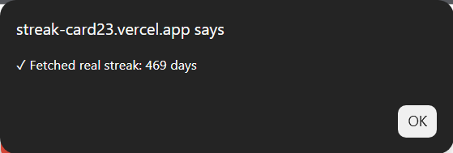

# Coding Streak Card Generator

[](https://vercel.com/new/clone?repository-url=https://github.com/VA-run23/streak-card23)
[](https://opensource.org/licenses/MIT)
[](https://nodejs.org/)
[](CONTRIBUTING.md)

A beautiful, dynamic streak card generator that displays your coding streaks across multiple platforms (GitHub, LeetCode, GeeksforGeeks, and more) in a single, shareable SVG card.


> **Quick Deploy**: Click the "Deploy with Vercel" button above or follow the [Quick Deploy Guide](QUICK_DEPLOY.md)

## Features

- **Real-time Data Fetching** - Automatically fetches your actual streak data from platforms
- **Customizable Design** - Choose from multiple color themes or use custom colors
- **Personalization** - Customize your name and greeting message
- **Clickable Cards** - Each platform links to your profile for verification
- **Multiple Platforms** - Support for GitHub, LeetCode, GeeksforGeeks, and more
- **Easy to Use** - Simple web interface to generate your card
- **Responsive** - Works on all devices
- **Embeddable** - Generate embed code for your GitHub profile or website


## Supported Platforms

Currently working APIs with real-time data fetching:

| Platform | Status | API Endpoint | Data Fetched |
|----------|--------|--------------|--------------|
| **GitHub** | ✅ Live | [streak-stats.demolab.com](https://streak-stats.demolab.com) | Current contribution streak |
| **LeetCode** | ✅ Live | [leetcode.com/graphql](https://leetcode.com/graphql) | Submission calendar & streak (max 365 days) |
| **GeeksforGeeks** | ✅ Live | [gfgstatscard.vercel.app](https://gfgstatscard.vercel.app) | Problem-solving streak |

Coming soon:
| Platform | Status | Notes |
|----------|--------|-------|
| Unstop | 🔜 Planned | API integration in progress |
| CodeChef | 🔜 Planned | Requires authentication |
| Codeforces | 🔜 Planned | API available |
| HackerRank | 🔜 Planned | API available |

## Quick Start

### Local Development

**Prerequisites**
- Node.js (v18 or higher)
- npm or yarn

**Installation**

1. Clone the repository:
```bash
git clone https://github.com/VA-run23/streak-card23.git
cd streak-card23
```

2. Install dependencies:
```bash
npm install
```

3. Start the development server:
```bash
npm run dev
```

4. Open your browser and navigate to `http://localhost:3000`

## Usage

### Web Interface

1. **Personalize Your Card**
   - Enter your name
   - Customize your greeting message
   - Choose a color theme (Orange, Blue, Purple, Red, Gold, or custom)

2. **Add Platforms**
   - Select a platform from the dropdown (GitHub, LeetCode, or GeeksforGeeks)
   - Enter your username for that platform
   - Click "Add Platform" - the streak will be fetched automatically from the live API
   - Repeat for other platforms



3. **Generate & Embed**
   - Preview your card in real-time
   - Copy the Markdown or HTML embed code
   - Add to your GitHub profile README

### Live Demo

Visit: **https://streak-card23.vercel.app**

### API Endpoints

#### Fetch Streak Data
```
GET /api/fetch-streak/:platform/:username
```

**Example:**
```bash
curl http://localhost:5000/api/fetch-streak/github/VA-run23
```

**Response:**
```json
{
  "platform": "github",
  "username": "VA-run23",
  "streak": 500,
  "source": "api",
  "url": "https://github.com/VA-run23"
}
```

#### Generate Streak Card
```
GET /api/streak-card?platforms=<encoded_json>&name=<your_name>&greeting=<greeting>&color=<hex_color>
```

**Parameters:**
- `platforms` (required): URL-encoded JSON array of platform objects
- `name` (optional): Your display name (default: "User")
- `greeting` (optional): Custom greeting message (default: "greets you with Namaste 🙏")
- `color` (optional): Hex color code for theme (default: "#FF8C42")

**Example:**
```
https://streak-card23.vercel.app/api/streak-card?platforms=%5B%7B%22platform%22%3A%22github%22%2C%22username%22%3A%22VA-run23%22%2C%22streak%22%3A500%7D%5D&name=VA-run23&greeting=Hello%20World&color=%234A90E2
```

## Embedding Your Card

### Markdown (GitHub Profile)
```markdown

```

### HTML
```html
&name=YourName&greeting=Your%20Greeting&color=%23FF8C42" alt="Coding Streaks" />
```

### Color Options

Choose from 5 preset colors or use any custom hex color:
- **Orange**: `#FF8C42` (default)
- **Blue**: `#4A90E2`
- **Purple**: `#9B59B6`
- **Red**: `#E74C3C`
- **Gold**: `#F39C12`
- **Custom**: Any hex color code (e.g., `#00FF00`, `#FF1493`)

## Project Structure

```
coding-streak-card/
├── api/                      # Vercel Serverless Functions
│   ├── fetch-streak.js      # Fetches streak data from platforms
│   └── streak-card.js       # Generates SVG streak card
├── server/                   # Express Server (Development)
│   └── index.js             # Local development server
├── src/                      # React Frontend
│   ├── App.jsx              # Main application component
│   ├── main.jsx             # React entry point
│   └── index.css            # Styles
├── public/                   # Static assets
├── index.html               # HTML entry point
├── package.json             # Dependencies
├── vite.config.js           # Vite configuration
├── vercel.json              # Vercel deployment config
└── README.md                # This file
```

## Third-Party APIs & Credits

This project uses the following third-party APIs to fetch real-time streak data:

### GitHub Streak Stats
- **API**: [streak-stats.demolab.com](https://streak-stats.demolab.com)
- **Creator**: [DenverCoder1](https://github.com/DenverCoder1)
- **Repository**: [github-readme-streak-stats](https://github.com/DenverCoder1/github-readme-streak-stats)
- **Usage**: Fetches GitHub contribution streaks via JSON endpoint
- **License**: MIT
- **Status**: ✅ Working

### LeetCode GraphQL API
- **API**: [leetcode.com/graphql](https://leetcode.com/graphql)
- **Official**: LeetCode's official GraphQL API
- **Usage**: Fetches submission calendar and calculates current streak (max 365 days)
- **Note**: Direct GraphQL queries to LeetCode's public API
- **Status**: ✅ Working

### GeeksforGeeks Stats Card
- **API**: [gfgstatscard.vercel.app](https://gfgstatscard.vercel.app)
- **Creator**: [Saurav Mukherjee](https://github.com/Saurav-98)
- **Repository**: [GeeksforGeeks-Stats-Card](https://github.com/Saurav-98/GeeksforGeeks-Stats-Card)
- **Usage**: Fetches GeeksforGeeks problem-solving streaks via SVG parsing
- **License**: MIT
- **Status**: ✅ Working

**Special Thanks** to all the creators of these amazing APIs for making their services publicly available!

## Development

### Local Development

Run both frontend and backend:
```bash
npm run dev
```

This starts:
- Frontend (Vite): `http://localhost:5173`
- Backend (Express): `http://localhost:5000`

### Build for Production

```bash
npm run build
```

## Deployment

### Deploy to Vercel

1. Install Vercel CLI:
```bash
npm install -g vercel
```

2. Deploy:
```bash
vercel
```

3. Follow the prompts to complete deployment

### Environment Variables

No environment variables required! All APIs are public.

## API Rate Limits

Be mindful of rate limits when using third-party APIs:
- **GitHub Streak Stats**: No strict limits
- **LeetCode Stats**: Reasonable use recommended
- **GFG Stats Card**: Reasonable use recommended

## Contributing

Contributions are welcome! Please read [CONTRIBUTING.md](CONTRIBUTING.md) for details on our code of conduct and the process for submitting pull requests.

### Quick Contribution Guide

1. Fork the repository
2. Create your feature branch (`git checkout -b feature/AmazingFeature`)
3. Commit your changes (`git commit -m 'feat: add some AmazingFeature'`)
4. Push to the branch (`git push origin feature/AmazingFeature`)
5. Open a Pull Request

See [CONTRIBUTING.md](CONTRIBUTING.md) for detailed guidelines on adding new platforms and features.

## License

This project is licensed under the MIT License - see the [LICENSE](LICENSE) file for details.

## Acknowledgments

- [DenverCoder1](https://github.com/DenverCoder1) for GitHub Streak Stats API
- [Arghya Ghosh (alfaarghya)](https://github.com/alfaarghya) for alfa-leetcode-api
- [Saurav Mukherjee](https://github.com/Saurav-98) for GeeksforGeeks Stats Card API
- All contributors who help improve this project

## Contact & Support

- Documentation: [DEPLOYMENT.md](DEPLOYMENT.md)
- Report Issues: [GitHub Issues](https://github.com/VA-run23/streak-card23/issues)
- Request Features: [New Issue](https://github.com/VA-run23/streak-card23/issues/new)
- Contributing Guide: [CONTRIBUTING.md](CONTRIBUTING.md)

## Project Stats


---

**Built by VA-run23 | NeuroBytes23**

Made with ❤️ by developers, for developers

**Star ⭐ this repository if you find it helpful!**

[](https://vercel.com/new/clone?repository-url=https://github.com/VA-run23/streak-card23)